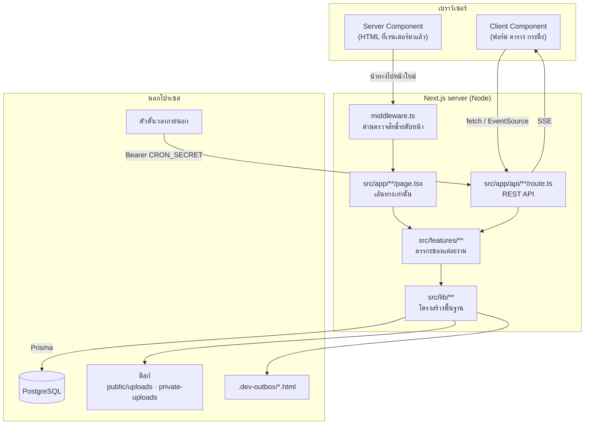
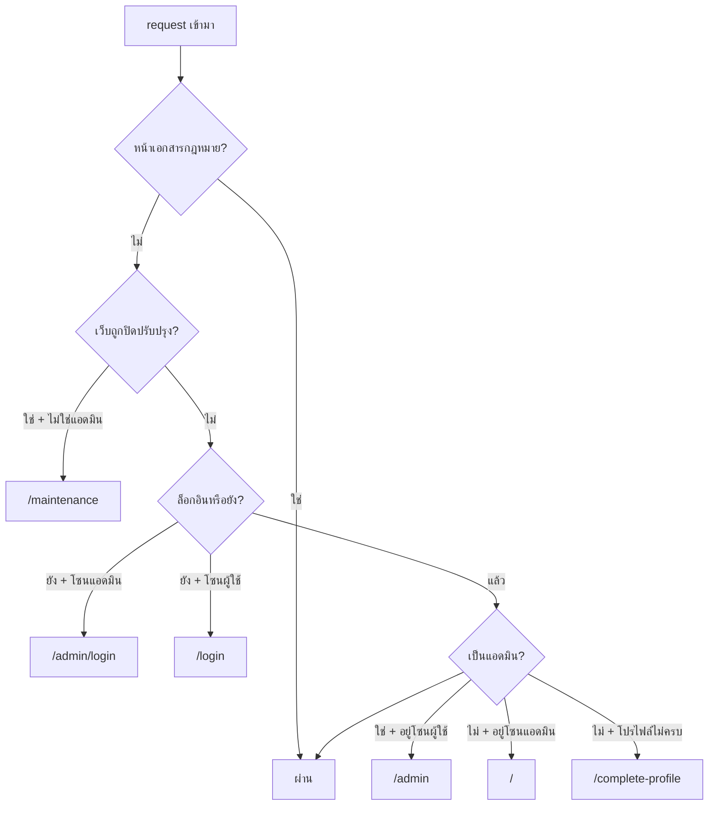

# สถาปัตยกรรม

ทุกอย่างในเอกสารนี้อธิบาย **โครง** — ว่าโค้ดถูกจัดวางยังไงและทำไม
ส่วนที่ว่าข้อมูลเดินทางยังไงจริง ๆ อยู่ที่ [flows.md](./flows.md)

---

## ภาพรวม

NineBooking เป็น Next.js App Router ตัวเดียวที่ทำทั้งหน้าเว็บและ API
ไม่มี backend แยก ไม่มี message queue ไม่มี service ภายนอกที่ต้องสมัคร



---

## กฎการวางไฟล์

อ่านสามข้อนี้แล้วจะเดาได้เองว่าโค้ดที่ต้องการอยู่ไฟล์ไหน

| ชั้น             | ที่อยู่                | มีอะไรได้                                              | ห้ามมี                     |
| ---------------- | ---------------------- | ------------------------------------------------------ | -------------------------- |
| เส้นทาง          | `src/app/`             | อ่าน request, เรียก guard, เรียก feature, ตอบ response | กฎธุรกิจ, query ที่ซับซ้อน |
| งาน (feature)    | `src/features/<ชื่อ>/` | component, hook, schema, service ของงานนั้น            | ของที่งานอื่นก็ใช้         |
| โครงสร้างพื้นฐาน | `src/lib/`             | ของที่ทุก feature ใช้ร่วมกัน                           | ตรรกะเฉพาะของงานใดงานหนึ่ง |

`src/app/api/orders/route.ts` จึงเป็นแค่ 4 ขั้น — ตรวจ session → validate ด้วย Zod →
เรียกงานจริง → ตอบกลับ ส่วนการรวมสินค้าหลักกับสินค้าคู่อยู่ที่
`src/features/orders/group-items.ts` และการออกเลขที่เอกสารอยู่ที่ `src/lib/document-number.ts`

---

## สองด่านตรวจสิทธิ์ที่ทำงานคนละหน้าที่

นี่คือจุดที่มักถูกเข้าใจผิดว่าซ้ำซ้อน — ไม่ซ้ำ เพราะกันคนละอย่าง

### ด่านที่ 1 — `src/middleware.ts` กันการเข้า "หน้า"

รันก่อนทุก request ที่ไม่ใช่ API และไม่ใช่ไฟล์ static
(ดู `config.matcher` ที่ท้ายไฟล์ — `api` ถูกยกเว้นไว้ชัดเจน)

ลำดับการตัดสินใจ:



สองจุดที่ตั้งใจเขียนแบบนั้น:

- **สถานะเปิด/ปิดเว็บถูกแคชไว้ 30 วินาทีต่อ worker** — middleware รันบน Edge runtime
  เรียก Prisma ตรง ๆ ไม่ได้ ต้อง `fetch` ไป `/api/settings/home-page` ถ้าไม่แคชคือ
  ยิง API เพิ่มหนึ่งครั้งต่อทุกการเปิดหน้า
- **origin ของ fetch นั้นยึดจาก `NEXT_PUBLIC_APP_URL` ไม่ใช่ `req.url`** — `req.url`
  ประกอบจาก `Host` header ที่ผู้เรียกตั้งเองได้ และโปรเจกนี้ตั้ง `trustHost: true`
  ถ้าใช้ `req.url` คนยิงจะปลอม Host ให้ middleware ไปถามเซิร์ฟเวอร์ของตัวเองแล้วสั่งเปิด/ปิดเว็บได้

### ด่านที่ 2 — `src/lib/api/guards.ts` กันการเรียก API

middleware ไม่ได้แตะ `/api/**` เลย ใครก็ยิง `curl` ตรงเข้ามาได้
API ทุกเส้นจึงต้องตรวจเอง และตรวจด้วยตัวช่วยชุดเดียวกัน:

```ts
const guard = await requireAdmin() // หรือ requireUser() / requireSuperAdmin()
if (!guard.ok) return guard.response
// ถึงตรงนี้ guard.user มี type ครบแล้ว
```

- `requireUser()` — ล็อกอินแล้วก็พอ
- `requireAdmin()` — `admin` หรือ `superadmin`
- `requireSuperAdmin()` — เฉพาะ `superadmin` ใช้กับเครื่องมือที่ลบข้อมูลได้

> **ห้ามเขียน `role === "admin"` ตรง ๆ ที่ไหนอีก** ใช้ `isAdminRole()` จาก
> `src/lib/roles.ts` เสมอ ตอนเพิ่ม `superadmin` เข้ามามี 17 จุดในโค้ดที่เทียบแบบนั้น
> ซึ่งจะปฏิเสธ superadmin ทั้งหมดโดยไม่มีใครรู้ตัว

---

## ชิ้นส่วนกลางใน `src/lib/`

แต่ละตัวแก้ปัญหาที่เคยเกิดจริง — รู้จักครบเจ็ดตัวนี้แล้วอ่านโค้ดส่วนอื่นได้หมด

### `db.ts` — Prisma client + `server-only`

บรรทัดแรกของไฟล์คือ `import "server-only"` ซึ่งทำให้ build พังทันทีถ้ามี
client component เผลอ import สายนี้เข้าไป

เคยเกิดจริง: หน้า `/admin/audit-log` เป็น client component แล้ว import ป้ายภาษาไทย
จาก `lib/audit` → `lib/db` → `lib/env` ทั้งสายถูกลากเข้าบันเดิลเบราว์เซอร์
แล้วพังตอนเปิดหน้าเพราะฝั่งเบราว์เซอร์ไม่มี `DATABASE_URL`

**ผลที่ตามมา:** ค่าคงที่ที่ทั้งสองฝั่งต้องใช้ต้องอยู่ไฟล์แยกที่ไม่ import อะไรจากฝั่งเซิร์ฟเวอร์
— นั่นคือเหตุผลที่มี `src/lib/audit-actions.ts` แยกจาก `src/lib/audit.ts`
และ `src/lib/roles.ts` ที่ไม่ import อะไรเลย

### `api/response.ts` — รูปแบบคำตอบชุดเดียว

ทุก error ตอบเป็น `{ error: string }` เหมือนกันหมด ฝั่ง client จึงอ่านที่เดียวพอ

`handleApiError(error, context)` วางไว้ที่ `catch` ท้าย route:
`ZodError` → 400 พร้อมรายชื่อฟิลด์ที่ผิด, `UploadError` → 400 พร้อมข้อความไทย,
ที่เหลือ log ไว้แล้วตอบ 500 กลาง ๆ ไม่ให้ stack trace หลุดออกไป

### `rate-limit.ts` — fixed window เก็บสถานะใน DB

```ts
const rate = await consume(`support:user:${user.id}`, RATE_LIMITS.support)
if (!rate.ok) return tooManyRequests(rate.retryAfterSec)
```

เก็บใน DB ไม่ใช่หน่วยความจำ เพราะ Next รันหลาย worker ตัวนับใน module scope
จึงกันอะไรไม่ได้จริง แลกกับการเขียน DB หนึ่งครั้งต่อการเรียกที่ถูกจำกัด

| กฎ               | เพดาน | หน้าต่าง | ใช้ที่                         |
| ---------------- | ----- | -------- | ------------------------------ |
| `loginPerEmail`  | 5     | 15 นาที  | กันเดารหัสของบัญชีใดบัญชีหนึ่ง |
| `loginPerIp`     | 20    | 15 นาที  | กันไล่ยิงหลายบัญชีจากที่เดียว  |
| `register`       | 5     | 1 ชม.    | `/api/auth/register`           |
| `forgotPassword` | 5     | 1 ชม.    | `/api/auth/forgot-password`    |
| `support`        | 10    | 1 ชม.    | `/api/support`                 |
| `upload`         | 60    | 1 ชม.    | `/api/upload/*`                |

### `document-number.ts` — เลขที่เอกสารที่ไม่ชนกัน

โค้ดเดิมของทั้งสามระบบนับด้วย `count() + 1` **นอก** ทรานแซกชัน
สองคนกด checkout พร้อมกันจึงได้เลขเดียวกัน คนที่เขียนทีหลังชน unique constraint
แล้วทั้งคำสั่งพัง — ที่แย่กว่าคือตะกร้าไม่ถูกล้าง ลูกค้าไม่รู้ว่าสั่งติดหรือไม่

ตอนนี้ใช้ตาราง `DocumentCounter` กับ `upsert ... increment` ซึ่ง atomic ระดับ row
ของ Postgres และ **บังคับให้รับ `tx`** ไม่ใช่ `prisma` ตัวเต็ม เพื่อให้เลขกับเอกสาร
commit พร้อมกัน ถ้าทรานแซกชัน rollback เลขก็คืนกลับไปด้วย

```ts
await prisma.$transaction(async (tx) => {
  const orderNumber = await nextOrderNumber(tx) // ORD-20260807-001
  await tx.order.create({ data: { orderNumber, ... } })
})
```

### `audit.ts` — ใครทำอะไรกับข้อมูลไหน

`recordAudit(tx, entry)` เขียนใน**ทรานแซกชันเดียวกับการเปลี่ยนข้อมูล** ถ้าการแก้
rollback บันทึกก็หายไปด้วย ไม่เหลือร่องรอยเท็จ
ส่วน `recordAuditSafely(entry)` ใช้เมื่อการเปลี่ยนแปลงเสร็จไปแล้วและการบันทึกล้มเหลว
ไม่ควรทำให้คำสั่งของผู้ใช้พังตาม

`diffFields(before, after)` เก็บเฉพาะฟิลด์ที่ค่าเปลี่ยนจริง บันทึกจึงไม่บวมด้วยค่าเดิม

### `storage/index.ts` — ไฟล์อัปโหลด

สองที่เก็บ แยกตามว่าใครควรเปิดดูได้:

| ที่เก็บ            | URL ที่ได้                    | ใครเปิดได้                      |
| ------------------ | ----------------------------- | ------------------------------- |
| `public/uploads/`  | `/uploads/products/…`         | ทุกคน (รูปสินค้า/หมวดหมู่)      |
| `private-uploads/` | `/api/files/support-issues/…` | เจ้าของเรื่องหรือแอดมินเท่านั้น |

**ชนิดไฟล์ตรวจจาก magic bytes ไม่ใช่จากชื่อไฟล์หรือ `Content-Type`** — ทั้งสองอย่างนั้น
client ตั้งเองได้ ถ้าเชื่อ จะส่งไฟล์ชื่อ `x.html` ที่ประกาศว่าเป็น `image/png`
แต่ข้างในเป็น `<script>` มาวางใน `public/` แล้วถูก serve เป็น HTML บน origin
เดียวกับเว็บได้ (`nosniff` ช่วยไม่ได้เพราะนามสกุลเป็น `.html` จริง ๆ)
ตาราง `SIGNATURES` ในไฟล์นั้นจึงเป็นแหล่งเดียวที่กำหนดนามสกุล

### `mailer/index.ts` — สลับผู้ให้บริการได้

```ts
export interface Mailer {
  send(message: MailMessage): Promise<MailResult>
}
```

ตัว default (`outbox`) เขียนอีเมลเป็นไฟล์ `.html` ลง `.dev-outbox/` เปิดดูในเบราว์เซอร์ได้
จะต่อของจริงให้เขียน object ที่ implement `Mailer` แล้วเพิ่มเข้า `DRIVERS` — ที่เรียกใช้ไม่ต้องแก้

`src/lib/env.ts` จะโยน error ถ้า `NODE_ENV=production` แต่ `MAIL_DRIVER` ยังเป็น `outbox`
เพราะลิงก์ตั้งรหัสผ่านใหม่จะไปกองอยู่บนดิสก์ ใครอ่านโฟลเดอร์นั้นได้ก็ยึดบัญชีใครก็ได้

### `realtime/channel.ts` — SSE

`SseChannel<T>` ห่อ `ReadableStream` + รายชื่อผู้ฟัง + heartbeat ทุก 30 วินาที
(กัน proxy ตัดสายที่เงียบนาน) มีสองช่อง: `order-notifications` และ `issue-notifications`

โค้ดนี้เคยอยู่ใน `route.ts` แล้ว route อื่น import ข้ามมาเรียก ซึ่งทำให้บางครั้ง
`Set` ที่เขียนกับที่อ่านเป็นคนละตัวเพราะ bundle แยกกัน — route module
ควร export แค่ HTTP handler เท่านั้น

> **ข้อจำกัดที่ต้องพูดถึงเสมอ:** รายชื่อผู้ฟังอยู่ในหน่วยความจำของ process
> รันหลาย instance เมื่อไหร่ แอดมินที่ต่อกับ instance A จะไม่ได้รับข้อความที่ยิงจาก B
> ของจริงต้องมี Redis pub/sub มาคั่น ฝั่ง client มี polling สำรองอยู่แล้ว

---

## ฐานข้อมูล

PostgreSQL + Prisma 20 ตาราง ดูรายละเอียดที่ [data-model.md](./data-model.md)

สองเรื่องที่ Prisma อธิบายใน schema ไม่ได้ จึงเขียน SQL เองใน migration:

- `Product.searchVector` เป็นคอลัมน์ `GENERATED ALWAYS` (tsvector)
- index `gin_trgm_ops` สำหรับการค้นแบบทนคำสะกดผิด

เพราะสองอย่างนี้ `prisma migrate diff --exit-code` จะรายงาน drift ตลอด
**CI จึงไม่มีด่านตรวจ drift โดยเจตนา**

> เมื่อไหร่ที่แตะชนิดข้อมูลหรือ enum ให้เขียน migration เอง — ตัวที่ Prisma generate ให้
> จะ `DROP COLUMN` แล้ว `ADD COLUMN` ใหม่ (ข้อมูลหาย) และสร้าง `ADD COLUMN ... NOT NULL`
> ที่ไม่มี `DEFAULT` (พังทันทีบนตารางที่ไม่ว่าง)

---

## งานตามเวลา

ไม่มี cron ในโปรเซส — มี endpoint เดียวที่ `/api/cron` ให้ตัวตั้งเวลาภายนอกเรียก
(`Authorization: Bearer <CRON_SECRET>` เทียบแบบ `timingSafeEqual`)
หรือให้แอดมินกดสั่งรันเองจากหน้าเครื่องมือระบบ

เดิมใช้ `node-cron` ที่ `instrumentation.ts` ซึ่งสร้างตัวจับเวลาซ้ำในทุก worker
และไม่ทำงานเลยบน serverless

งานที่รัน (ทั้งหมดพร้อมกันด้วย `Promise.all`):

| งาน                           | ทำอะไร                                                 |
| ----------------------------- | ------------------------------------------------------ |
| `archiveProductViews()`       | ยุบ `ProductView` รายแถว → `ProductViewSummary` รายวัน |
| `cleanupExpiredResetTokens()` | ลบ token ตั้งรหัสผ่านที่หมดอายุ                        |
| `cleanupExpiredRateLimits()`  | ลบตัวนับ rate limit ที่พ้นอายุ                         |
| `expireQuotations()`          | ปิดใบเสนอราคาที่เลย `validUntil`                       |
| `cleanupOldAuditLogs()`       | ลบบันทึกที่เก่ากว่า 365 วัน                            |

---

## เทสต์

| ชนิด        | เครื่องมือ | ครอบอะไร                                                          |
| ----------- | ---------- | ----------------------------------------------------------------- |
| unit        | Vitest     | ตรรกะล้วน — state machine ของสถานะ, การรวมรายการ, การตรวจชนิดไฟล์ |
| smoke (e2e) | Playwright | เส้นทางสำคัญจริงในเบราว์เซอร์                                     |

Vitest alias `server-only` ไปที่ stub ว่าง (`src/test/server-only-stub.ts`) ไม่งั้นไฟล์ที่
import `lib/db` จะรันในเทสต์ไม่ได้ — ดู `vitest.config.ts`

**ไฟล์เทสต์แต่ละตัวครอบอะไร และ CI ตรวจอะไรบ้าง อยู่ที่ [testing.md](./testing.md)**

คำสั่งตรวจก่อน commit อยู่ใน [CONTRIBUTING.md](../CONTRIBUTING.md)
