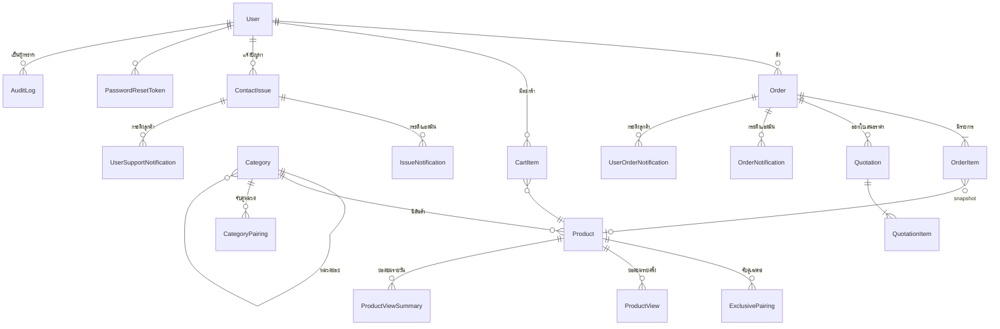

# โครงฐานข้อมูล

25 ตารางใน `prisma/schema.prisma` เอกสารนี้อธิบายว่าแต่ละกลุ่มทำหน้าที่อะไร
และ **ทำไม** ถึงออกแบบแบบนั้น ส่วนรายละเอียดฟิลด์อ่านจาก schema ได้ตรง ๆ

---

## แผนผังความสัมพันธ์



---

## ตารางแยกตามกลุ่ม

### บัญชีและความปลอดภัย

| ตาราง                | เก็บอะไร                                                  |
| -------------------- | --------------------------------------------------------- |
| `User`               | บัญชีผู้ใช้ + `role` + ที่อยู่ (รหัสผ่านเป็น bcrypt hash) |
| `PasswordResetToken` | ลิงก์ตั้งรหัสผ่านใหม่ (เก็บ **hash** ของ token)           |
| `RateLimit`          | ตัวนับการเรียกถี่ ใช้ร่วมกันทุกจุด                        |
| `DocumentCounter`    | ตัวนับเลขที่เอกสาร `ORD-` / `ISS-` / `QT-`                |
| `AuditLog`           | ใครทำอะไรกับข้อมูลไหนเมื่อไหร่                            |

ไม่มีตาราง `Account` / `Session` เพราะใช้ NextAuth แบบ Credentials + JWT
สถานะการล็อกอินอยู่ใน cookie ไม่ได้อยู่ใน DB

### แคตตาล็อก

| ตาราง                | เก็บอะไร                                         |
| -------------------- | ------------------------------------------------ |
| `Category`           | หมวดหมู่ ซ้อนกันได้ผ่าน self-relation `parentId` |
| `Product`            | สินค้า + `searchVector` + `datasheets` (Json)    |
| `CategoryPairing`    | หมวด A จับคู่ได้กับหมวด B                        |
| `ExclusivePairing`   | สินค้า A จับคู่ได้เฉพาะกับสินค้า B               |
| `ProductView`        | การเข้าชมรายครั้ง (ชั่วคราว)                     |
| `ProductViewSummary` | ยอดเข้าชมสรุปรายวัน (ถาวร)                       |

### ตะกร้าและใบจอง

| ตาราง       | เก็บอะไร                                               |
| ----------- | ------------------------------------------------------ |
| `CartItem`  | ตะกร้า คีย์เป็น `(userId, productId, pairedProductId)` |
| `Order`     | ใบจอง + snapshot ผู้จองและที่อยู่                      |
| `OrderItem` | รายการในใบจอง + snapshot ชื่อ/รูปสินค้า                |

### ใบเสนอราคา

| ตาราง               | เก็บอะไร                                           |
| ------------------- | -------------------------------------------------- |
| `Quotation`         | ใบเสนอราคา + `version` / `baseNumber` / `isLatest` |
| `QuotationItem`     | รายการพร้อมราคา (`Decimal(12,2)`)                  |
| `QuotationSettings` | ข้อมูลบริษัทที่พิมพ์ลงหัว PDF                      |
| `QuotationSeller`   | รายชื่อผู้ขายที่เลือกใส่ในใบได้                    |

### แจ้งปัญหาและการแจ้งเตือน

| ตาราง                     | ฝั่งไหน | เมื่อไหร่ถึงสร้าง                   |
| ------------------------- | ------- | ----------------------------------- |
| `ContactIssue`            | —       | ลูกค้าส่งเรื่อง                     |
| `OrderNotification`       | แอดมิน  | มีใบจองใหม่                         |
| `IssueNotification`       | แอดมิน  | มีเรื่องแจ้งปัญหาใหม่               |
| `UserOrderNotification`   | ลูกค้า  | แอดมินเปลี่ยนสถานะใบจอง             |
| `UserSupportNotification` | ลูกค้า  | แอดมินตอบกลับหรือเปลี่ยนสถานะเรื่อง |

### ตั้งค่า

`SystemSettings` (เปิด/ปิดเว็บ) · `SeoSettings` (title, description, OG, GA)

---

## การตัดสินใจที่ควรอธิบายได้

### 1. snapshot ข้อมูลลงเอกสาร

`OrderItem` เก็บ `productName` / `productImage` ซ้ำจาก `Product`
และ `Order` เก็บชื่อ อีเมล ที่อยู่ผู้จองซ้ำจาก `User`

**เหตุผล:** เอกสารต้องอ่านได้เหมือนวันที่ออก ถ้า join เอาชื่อปัจจุบันมาแสดง
พอแอดมินแก้ชื่อสินค้าหรือลูกค้าย้ายบ้าน ใบจองเมื่อปีที่แล้วจะเปลี่ยนตามไปด้วย

### 2. `onDelete` ที่เลือกต่างกันในแต่ละความสัมพันธ์

| ความสัมพันธ์        | นโยบาย     | เหตุผล                                                                                        |
| ------------------- | ---------- | --------------------------------------------------------------------------------------------- |
| `Product.category`  | `Restrict` | ลบหมวดที่ยังมีสินค้าอยู่ไม่ได้ ต้องย้ายออกก่อน                                                |
| `Category.parent`   | `Cascade`  | หมวดย่อยไม่มีความหมายถ้าไม่มีหมวดแม่                                                          |
| `OrderItem.product` | `SetNull`  | ประวัติยังอ่านออกจาก snapshot — ของเดิมเป็น `Restrict` จึงลบสินค้าที่เคยมีคนสั่งไม่ได้ตลอดกาล |
| `Order.user`        | `SetNull`  | ลบบัญชีแล้วใบจองยังอยู่ในรายงาน                                                               |
| `CartItem.*`        | `Cascade`  | ตะกร้าไม่ใช่ประวัติ หายไปพร้อมเจ้าของได้                                                      |

### 3. ยอดเข้าชมแยกสองตาราง

`ProductView` โตทุกครั้งที่มีคนเปิดหน้าสินค้า ถ้าให้กราฟย้อนหลัง 90 วัน
นับจากตารางนี้ตรง ๆ query จะช้าลงเรื่อย ๆ ตามอายุระบบ

งานตามเวลาจึงยุบเป็น `ProductViewSummary` (unique ที่ `productId + date`)
แล้วลบแถวดิบทิ้ง — กราฟอ่านจากตารางที่ขนาดคงที่ต่อวัน

### 4. เวอร์ชันของใบเสนอราคา

สามฟิลด์ทำงานร่วมกัน:

| ฟิลด์        | ความหมาย                                    |
| ------------ | ------------------------------------------- |
| `baseNumber` | เลขฐาน `QT-2026-0001` เหมือนกันทุกเวอร์ชัน  |
| `version`    | 1, 2, 3 … เลขที่แสดงจะเป็น `QT-2026-0001V2` |
| `isLatest`   | มีได้ตัวเดียวต่อ `baseNumber`               |

หน้ารายการและสถิติกรอง `isLatest: true` เสมอ ใบเดียวจึงไม่ถูกนับซ้ำ
และลูกค้ากดยอมรับได้เฉพาะฉบับล่าสุด (ไม่งั้นจะยอมรับราคาเก่าที่ถูกแก้ไปแล้ว)

### 5. `searchVector` เป็น `Unsupported`

```prisma
searchVector Unsupported("tsvector")?
@@index([searchVector], type: Gin)
```

คอลัมน์นี้เป็น `GENERATED ALWAYS` ที่ Postgres คำนวณเองจาก `name` / `subtitle` /
`description` — เขียนไว้ใน migration ด้วยมือ Prisma อธิบายไม่ได้จึงอ่านผ่าน `$queryRaw`

ผลข้างเคียง: `prisma migrate diff --exit-code` รายงาน drift ตลอด
**CI จึงไม่มีด่านตรวจ drift โดยเจตนา** (มีคอมเมนต์อธิบายไว้ใน `.github/workflows/ci.yml`)

### 6. กระดิ่งแยกฝั่งแอดมินกับฝั่งลูกค้า

ไม่ได้ใช้ตารางเดียวแล้วใส่ฟิลด์ `audience` เพราะข้อมูลที่ต้องเก็บต่างกันจริง —
ฝั่งแอดมินอยากรู้ชื่อลูกค้ากับจำนวนรายการ ฝั่งลูกค้าอยากรู้ว่าสถานะเปลี่ยนจากอะไรเป็นอะไร
(`oldStatus` / `newStatus`) การยัดรวมกันจะได้ตารางที่ครึ่งหนึ่งของคอลัมน์เป็น null เสมอ

---

## เรื่องที่ต้องระวังเวลาแก้ schema

**เขียน migration เองเสมอเมื่อแตะชนิดข้อมูลหรือ enum**
`prisma migrate diff` จะสร้าง `DROP COLUMN` แล้ว `ADD COLUMN` ใหม่ (ข้อมูลหาย)
และสร้าง `ADD COLUMN ... NOT NULL` ที่ไม่มี `DEFAULT` (พังทันทีบนตารางที่ไม่ว่าง)

ให้ใช้ `USING` แปลงค่า และใส่ `DEFAULT` ตอน `ADD COLUMN` แล้วค่อย `DROP DEFAULT`
ดูตัวอย่างที่ `prisma/migrations/20260807000000_security_and_document_counters`
และ `20260807010000_schema_cleanup`

**`findMany({ distinct })` ไม่มี LIMIT**
Prisma ทำ `distinct` กับ `take` ในหน่วยความจำ **หลัง** ดึงข้อมูลมาแล้ว
คือขนทั้งตารางมาทุกครั้ง ใช้ `groupBy` แทนซึ่งถูกแปลเป็น `GROUP BY` จริง
