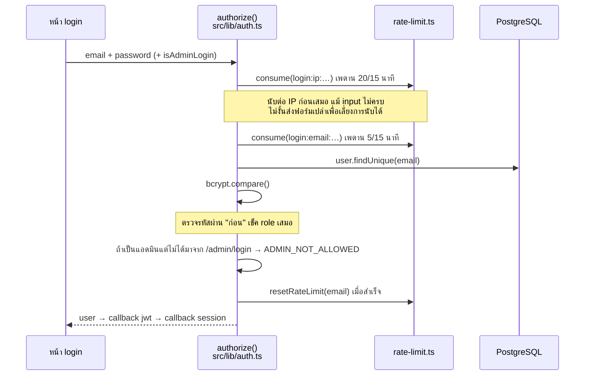
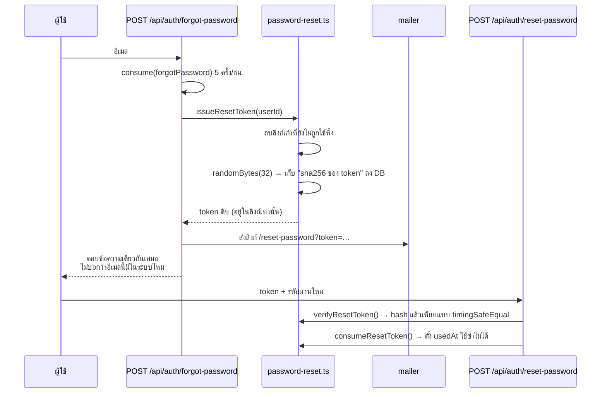
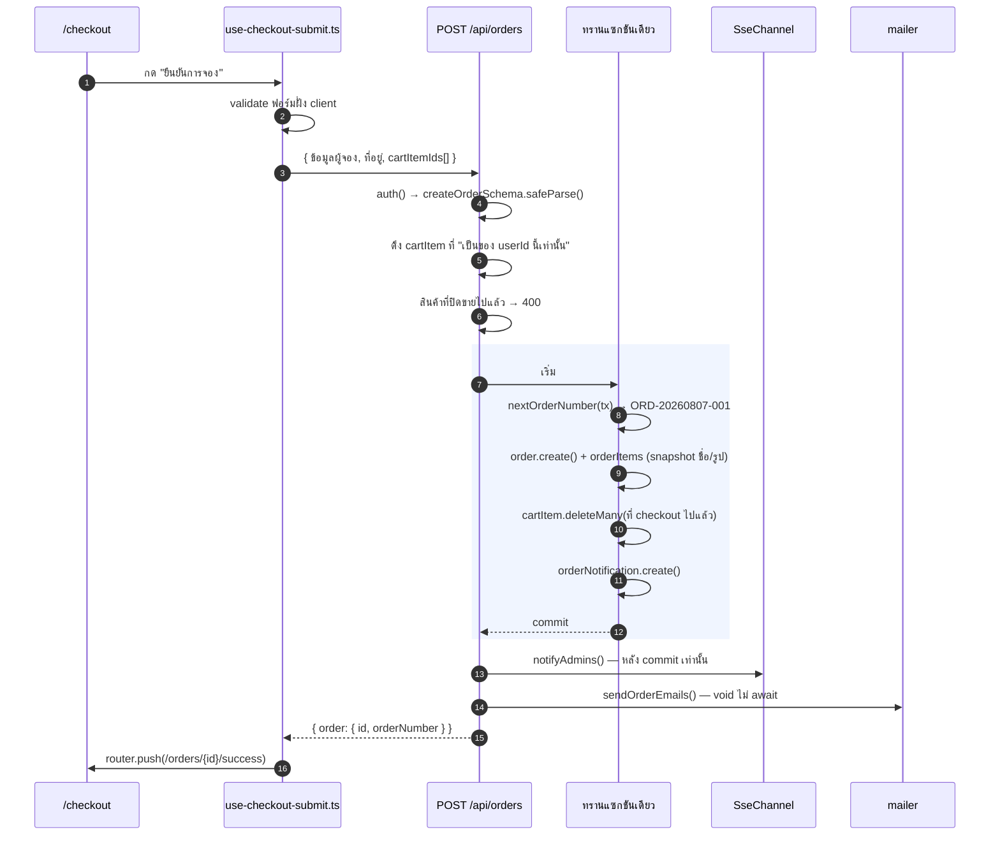
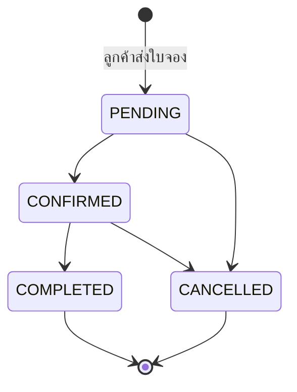
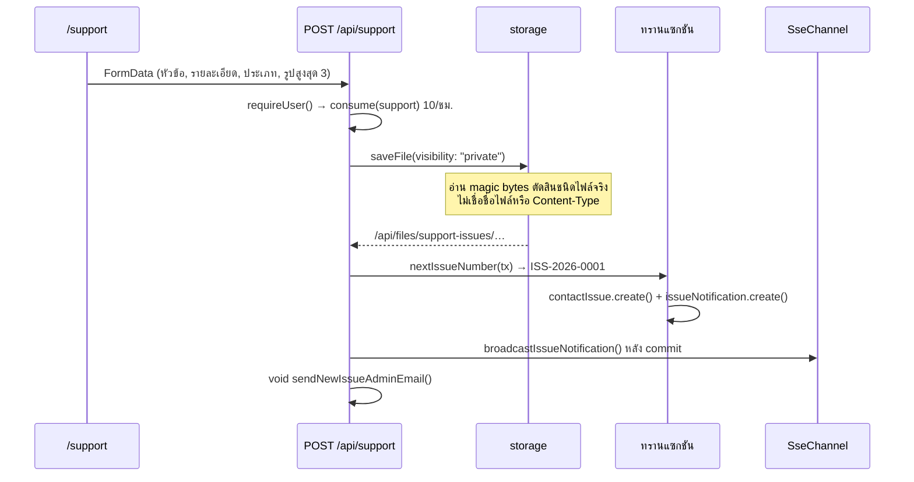

# เส้นทางการทำงาน

แต่ละหัวข้อไล่ตั้งแต่ผู้ใช้กดปุ่ม จนถึงข้อมูลลงฐานข้อมูล พร้อมชื่อไฟล์จริงทุกขั้น
โครงของระบบอยู่ที่ [architecture.md](./architecture.md)

**สารบัญ**

- [สมัครสมาชิกและเข้าสู่ระบบ](#สมัครสมาชิกและเข้าสู่ระบบ)
- [ลืมรหัสผ่าน](#ลืมรหัสผ่าน)
- [ค้นหาและดูสินค้า](#ค้นหาและดูสินค้า)
- [ตะกร้าสินค้า](#ตะกร้าสินค้า)
- [ส่งใบจอง](#ส่งใบจอง-เส้นทางหลักของระบบ) ← เส้นทางหลัก
- [แจ้งเตือนเรียลไทม์](#แจ้งเตือนเรียลไทม์)
- [แอดมินเปลี่ยนสถานะใบจอง](#แอดมินเปลี่ยนสถานะใบจอง)
- [ใบเสนอราคา](#ใบเสนอราคา)
- [แจ้งปัญหาและไฟล์แนบ](#แจ้งปัญหาและไฟล์แนบ)
- [รายงานและการส่งออก](#รายงานและการส่งออก)
- [ประวัติการใช้งานระบบ](#ประวัติการใช้งานระบบ)
- [งานตามเวลา](#งานตามเวลา)

---

## สมัครสมาชิกและเข้าสู่ระบบ

### สมัครสมาชิก

ฟอร์มแบ่งเป็นสองขั้น (ข้อมูลบัญชี → ข้อมูลติดต่อ) แล้วยิงครั้งเดียวตอนจบ

```
src/app/(public)/register/page.tsx
  └─ POST /api/auth/register          src/app/api/auth/register/route.ts
       ├─ consume(register:ip:…)      src/lib/rate-limit.ts   5 ครั้ง/ชม. ต่อ IP
       │                              นับก่อน parse เสมอ — ปลายทางคือ bcrypt
       │                              cost 12 ซึ่งยิงรัวแล้ว CPU ตาย
       ├─ registerSchema.parse()      src/features/auth/schema.ts
       ├─ อีเมลซ้ำ → 400 "อีเมลนี้ถูกใช้งานแล้ว"
       ├─ bcrypt.hash(password, 12)
       └─ prisma.user.create()        select เฉพาะฟิลด์ที่ส่งกลับ
                                      กันไม่ให้ password hash หลุดออกไป
  └─ router.push("/login?registered=true")
```

**ไม่ได้ล็อกอินให้อัตโนมัติ** — สมัครเสร็จจะถูกพาไปหน้า login พร้อม
query `registered=true` เพื่อให้หน้านั้นขึ้นข้อความว่าสมัครสำเร็จแล้ว

### เข้าสู่ระบบ

หน้าลูกค้า (`/login`) กับหน้าแอดมิน (`/admin/login`) ใช้ provider ตัวเดียวกัน
ต่างกันที่หน้าแอดมินส่งฟิลด์ `isAdminLogin: "true"` มาด้วย



**ทำไมต้องตรวจรหัสผ่านก่อนเช็ค role:** เดิมโค้ดเช็ค role ไว้เหนือ `bcrypt.compare`
ผลคือใครก็ได้ยิงรหัสมั่ว ๆ แล้วดูว่าได้ `ADMIN_NOT_ALLOWED` หรือ `INVALID_CREDENTIALS`
ก็รู้ทันทีว่าอีเมลไหนเป็นแอดมิน โดยไม่ต้องรู้รหัสผ่านและไม่ถูกนับว่ากรอกผิดด้วย

**ข้อมูลใน session** ไม่ได้ query ใหม่ทุกครั้ง — callback `jwt` ยัด `role`, `nickname`,
`phone`, ที่อยู่ ลง token ตอนล็อกอิน แล้ว callback `session` แปลงกลับให้ client
ตอนแก้โปรไฟล์ ฝั่ง client เรียก `update()` → `trigger === "update"` → เขียนทับใน token
(ไม่งั้นต้องออกจากระบบแล้วเข้าใหม่ข้อมูลถึงจะตรง)

| ไฟล์                                      | หน้าที่                                                         |
| ----------------------------------------- | --------------------------------------------------------------- |
| `src/lib/auth.ts`                         | provider, callbacks, การตรวจรหัสผ่าน                            |
| `src/app/api/auth/[...nextauth]/route.ts` | ส่ง handler ของ NextAuth ออกไปเป็น route                        |
| `src/app/api/auth/check-lock/route.ts`    | ถามว่าบัญชีนี้ถูกล็อกอยู่ไหม — เรียกจาก `/admin/login` เท่านั้น |
| `src/types/next-auth.d.ts`                | ขยาย type ของ session ให้มีฟิลด์ที่เพิ่ม                        |

---

## ลืมรหัสผ่าน



ที่ต้องรู้:

- **เก็บเฉพาะ hash ลง DB** ค่าดิบอยู่ในลิงก์ที่ส่งให้ผู้ใช้เท่านั้น ฐานข้อมูลรั่วก็ยังตั้งรหัสใหม่ไม่ได้
- **หมดอายุ 30 นาที ใช้ได้ครั้งเดียว** และมีลิงก์ที่ใช้ได้ทีละใบ (ขอใหม่ = ใบเก่าตายทันที)
- **ตอบเหมือนกันทุกกรณี** ไม่ให้ใช้หน้านี้ไล่หาว่าอีเมลไหนมีบัญชีอยู่
- โหมด dev อีเมลไปโผล่ที่ `.dev-outbox/*.html` เปิดด้วยเบราว์เซอร์แล้วกดลิงก์ได้เลย

ไฟล์: `src/features/auth/password-reset.ts` · `src/app/api/auth/forgot-password/route.ts`
· `src/app/api/auth/reset-password/route.ts` · `src/lib/mailer/auth-mail.ts`

---

## ค้นหาและดูสินค้า

หน้าแรกเป็น client component ที่อ่านเงื่อนไขจาก URL แล้วยิง API ใหม่ทุกครั้งที่ URL เปลี่ยน

```
src/app/page.tsx  (รายการสินค้า — "use client")
  └─ useEffect  ทำงานใหม่เมื่อ page / sort / search / categorySlug ใน URL เปลี่ยน
       └─ GET /api/products?page=1&limit=12&sort=…&search=…&categorySlug=…
            src/app/api/products/route.ts
              ├─ คำค้น ≥ 2 ตัวอักษร → searchProductIds()
              │    src/features/products/services/search-products.ts  ← ที่เดียวที่ใช้ $queryRaw
              └─ สั้นกว่านั้น → Prisma contains (ILIKE) ตามเดิม
```

| พารามิเตอร์    | ค่าเริ่มต้น  | หมายเหตุ                                                                 |
| -------------- | ------------ | ------------------------------------------------------------------------ |
| `page`         | `1`          |                                                                          |
| `limit`        | `12`         | หน้าแรกตรึงไว้ที่ 12                                                     |
| `sort`         | `"category"` |                                                                          |
| `search`       | —            | ส่งเฉพาะเมื่อมีค่า                                                       |
| `categorySlug` | —            | **ไม่ใช่ `category`** — route รับ `categoryId` ได้ด้วยแต่หน้าแรกส่ง slug |

**`AbortController`** ที่ห่อ `fetch` ไว้ยกเลิก request เก่าเมื่อผู้ใช้พิมพ์ค้นหาเร็ว ๆ
หรือกดเปลี่ยนหน้ารัว ๆ ไม่งั้นผลของ request เก่าอาจมาถึงทีหลังแล้วทับของใหม่
(ตัว `catch` จงใจเงียบเมื่อเป็น `AbortError` เพราะนั่นไม่ใช่ความผิดพลาด)

การค้นใช้สองกลไกคู่กันในคำสั่งเดียว:

| กลไก                      | ทำอะไร                                        |
| ------------------------- | --------------------------------------------- |
| `searchVector @@ tsquery` | คำที่ตรง + คะแนนความเกี่ยวข้องตามน้ำหนักฟิลด์ |
| `pg_trgm` (`<%`)          | ทนคำสะกดผิด — "กลอง" เจอ "กล้อง"              |

รายละเอียดที่ทำให้มันทำงานได้จริง:

- คำค้นถูกแปลงเป็น **prefix query** (`"กล้อง วง"` → `กล้อง:* & วง:*`) พิมพ์ไม่จบคำก็เจอ
  และอักขระพิเศษของ `tsquery` ถูกตัดทิ้ง ผู้ใช้จึงเขียน query เองไม่ได้
- เกณฑ์ความคล้ายตั้งไว้ **0.4** ไม่ใช่ค่าปริยาย 0.6 — ภาษาไทย "กลอง" กับ "กล้อง"
  ได้แค่ 0.40 เพราะวรรณยุกต์ทำให้ไตรแกรมต่างกัน
- ตั้งเกณฑ์ด้วย `set_config(..., true)` **ในทรานแซกชันเดียวกับ query** เพราะ Prisma
  ใช้ connection pool แต่ละ query อาจได้คนละ connection
  (ถ้าเขียน `word_similarity(...) > 0.4` ตรง ๆ จะได้ผลเหมือนกันแต่ index ใช้ไม่ได้ กลายเป็น seq scan)
- แยกสองขั้น: raw SQL หา **id** เรียงตามความเกี่ยวข้อง แล้วดึงรายละเอียดด้วย Prisma ปกติ
  ส่วนที่เป็น raw จริง ๆ จึงเล็กและตรวจสอบง่าย

### หน้ารายละเอียดสินค้าและการจับคู่

หน้านี้แบ่งงานกันสองชั้น — **page เป็น server component ที่ไม่ยิง API เลย**

```
src/app/products/[slug]/page.tsx          Server Component
  ├─ generateMetadata()  query Prisma ตรง ๆ เพื่อตั้งชื่อแท็บเป็นชื่อสินค้า
  └─ <ProductDetail slug={slug} />        ส่งต่อแค่ slug
       src/features/products/components/product-detail.tsx   ("use client")
         ├─ GET  /api/products/{slug}          ข้อมูลสินค้า + สินค้าที่เกี่ยวข้อง
         ├─ POST /api/products/{slug}/view     นับยอดเข้าชม (กันซ้ำ 1 ครั้ง/คน/วัน)
         └─ GET  /api/products/{slug}/paired   สินค้าที่จับคู่ได้
```

ที่แบ่งแบบนี้เพราะชื่อแท็บต้องถูกต้องตั้งแต่ HTML ชุดแรก (server component ทำได้)
แต่เนื้อหาข้างในต้องโต้ตอบได้ — เลือกคู่จับ เพิ่มลงตะกร้า (ต้องเป็น client)

> **`generateMetadata` ที่นี่ไม่ใช่งาน SEO** แม้จะเป็น API ตัวเดียวกับที่ปกติใช้ทำ SEO
> หน้านี้อยู่หลังการล็อกอิน crawler จึงเห็นแค่ redirect ไปหน้า login และ
> [`robots.ts`](../src/app/robots.ts) ก็ `disallow: "/"` ทั้งเว็บ — ด้วยเหตุนี้
> Open Graph / Twitter card / canonical และ `sitemap.ts` จึงถูกถอดออกไปแล้ว
> สิ่งที่ยังได้ผลจริงคือ **ชื่อแท็บเบราว์เซอร์ ประวัติการเข้าชม และบุ๊กมาร์ก**
> ของคนที่ล็อกอินแล้ว ([`lib/seo.ts`](../src/lib/seo.ts) จึงคืนแค่ `title` กับ `description`)

> **สังเกตรูปแบบ URL** ตัว `slug` ไปอยู่ใน path ไม่ใช่ query string
> `/api/products/camera-in-200` จึงเข้า `api/products/[slug]/route.ts`
> ส่วน `/api/products?page=1` เข้า `api/products/route.ts` เพราะ query string
> ไม่นับเป็น path segment ฝั่ง route รับค่าผ่าน argument ตัวที่สอง
> (`{ params }: { params: Promise<{ slug: string }> }` — ต้อง `await` ตั้งแต่ Next 15)

การจับคู่มีสองระดับ ซึ่งทำงานทับกัน:

| ตาราง              | ความหมาย                                           |
| ------------------ | -------------------------------------------------- |
| `CategoryPairing`  | หมวด A จับคู่กับหมวด B ได้ทั้งหมด                  |
| `ExclusivePairing` | สินค้าตัวนี้จับคู่ได้เฉพาะกับสินค้าที่ระบุเท่านั้น |

สินค้าที่มี exclusive pairing จะไม่แสดงในการจับคู่ระดับหมวดปกติ เว้นแต่ตั้ง
`Product.showCategoryPairings = true`

---

## ตะกร้าสินค้า

state ทั้งแอปอยู่ที่ `src/features/cart/cart-context.tsx` (React Context)
ทุกการเปลี่ยนแปลงยิง API แล้วค่อย refresh — ไม่มี optimistic update

**component ไม่ยิง API เอง** — ทุกตัวเรียกฟังก์ชันจาก context แล้ว context เป็นคนยิง
(`fetch` ทั้ง 5 จุดอยู่ในไฟล์ `cart-context.tsx` ไฟล์เดียว)

```
src/features/cart/components/add-to-cart-button.tsx
  └─ useCart().addItem(...)
       src/features/cart/cart-context.tsx
         └─ POST /api/cart          { productId, quantity, pairedProductId? }
              ├─ ตรวจว่าสินค้ายัง isActive
              ├─ มีชุดนี้ในตะกร้าแล้ว → เพิ่มจำนวน (เพดาน 99)
              └─ ยังไม่มี → สร้างแถวใหม่
```

**คีย์ของตะกร้าคือ `(userId, productId, pairedProductId)`** ไม่ใช่แค่ `productId`
กล้องตัวเดียวกันที่จับคู่กับขาตั้งคนละรุ่นจึงเป็นคนละแถว และนับจำนวนแยกกัน
(บังคับด้วย unique constraint ที่ระดับฐานข้อมูล ไม่ได้เช็คแค่ในโค้ด)

| ปลายทาง                 | ทำอะไร                    |
| ----------------------- | ------------------------- |
| `GET /api/cart`         | ดึงตะกร้าทั้งหมดของผู้ใช้ |
| `POST /api/cart`        | เพิ่มสินค้า               |
| `PATCH /api/cart/[id]`  | แก้จำนวนหรือเปลี่ยนคู่จับ |
| `DELETE /api/cart/[id]` | ลบรายการเดียว             |
| `DELETE /api/cart`      | ล้างทั้งตะกร้า            |

---

## ส่งใบจอง (เส้นทางหลักของระบบ)

นี่คือเส้นทางที่แตะเกือบทุกชิ้นส่วนของระบบ — ทรานแซกชัน เลขที่เอกสาร กระดิ่ง และอีเมล



### สี่จุดที่เป็นสาระของ flow นี้

**1. เลขที่ใบจองต้องขอ "ข้างใน" ทรานแซกชัน**
ของเดิมนับ order ของวันนี้แล้ว +1 ไว้ข้างนอก คนที่กด checkout พร้อมกันจึงได้เลขเดียวกัน
ตัวที่เขียนทีหลังชน unique constraint แล้วพังทั้งคำสั่ง — และเพราะพังหลังจากนั้น
ตะกร้าก็ไม่ถูกล้าง ลูกค้าเลยไม่รู้ว่าสั่งติดหรือไม่ติด

**2. สร้างใบจอง ล้างตะกร้า และสร้างกระดิ่ง อยู่ในทรานแซกชันเดียวกัน**
ทั้งสามอย่างต้องเกิดพร้อมกันหรือไม่เกิดเลย — ไม่งั้นจะมีเคสตะกร้าถูกล้างแต่ใบจองไม่มี

**3. กระดิ่งเรียลไทม์ยิง _หลัง_ commit**
ถ้ายิงข้างในทรานแซกชัน แอดมินอาจเห็นแจ้งเตือนของใบจองที่สุดท้าย rollback ไป

**4. อีเมลไม่บล็อกการตอบกลับ**
`void sendOrderEmails(...)` — ส่งไม่สำเร็จก็แค่ log ลูกค้ายังจองติดตามปกติ

### snapshot ข้อมูลสินค้า

`OrderItem` เก็บ `productName` / `productImage` / `pairedProductName` ซ้ำจากตาราง `Product`
เพราะถ้าแอดมินแก้ชื่อหรือปิดสินค้าทีหลัง ใบจองเก่าต้องยังอ่านได้เหมือนวันที่สั่ง
ที่อยู่และชื่อผู้จองใน `Order` ก็เป็น snapshot ด้วยเหตุผลเดียวกัน

### ไฟล์ที่เกี่ยวข้อง

| ไฟล์                                               | หน้าที่                               |
| -------------------------------------------------- | ------------------------------------- |
| `src/app/checkout/page.tsx`                        | ประกอบหน้า เลือกรายการที่จะจอง        |
| `src/features/orders/hooks/use-checkout-form.ts`   | state ของฟอร์ม + เติมข้อมูลจากโปรไฟล์ |
| `src/features/orders/hooks/use-checkout-submit.ts` | validate + ยิง API + พาไปหน้าสำเร็จ   |
| `src/app/api/orders/route.ts`                      | สร้างใบจอง (POST) / ประวัติ (GET)     |
| `src/lib/document-number.ts`                       | ออกเลขที่ใบจอง                        |
| `src/features/orders/group-items.ts`               | รวมสินค้าหลัก + สินค้าคู่เป็นกลุ่ม    |
| `src/lib/mailer/order-mail.tsx`                    | อีเมลถึงลูกค้าและถึงแอดมิน            |

### ลูกค้ายกเลิกเอง

`PATCH /api/orders/[id]` ด้วย `{ action: "cancel" }` — ต้องเป็นใบของตัวเองและ
สถานะยังเป็น `PENDING` เท่านั้น บันทึก `cancelledBy = "CUSTOMER"`

---

## แจ้งเตือนเรียลไทม์

มีสองฝั่งที่ทำงานคนละแบบ

### ฝั่งแอดมิน — Server-Sent Events

```
src/features/notifications/hooks/use-notifications.ts   (client)
  ├─ fetch ครั้งแรก   GET /api/admin/notifications        + /api/admin/issue-notifications
  ├─ EventSource      GET /api/admin/notifications/stream
  └─ EventSource      GET /api/admin/issue-notifications/stream
                          └─ subscribeOrderNotifications(signal)
                               src/lib/realtime/channel.ts
```

ฝั่งเซิร์ฟเวอร์ที่ยิงข้อความคือ `notifyAdmins()` ใน `POST /api/orders`
และ `broadcastIssueNotification()` ใน `POST /api/support`

- heartbeat ทุก 30 วินาที กัน proxy ตัดสายที่เงียบนาน
- client ต่อใหม่เองเมื่อสายหลุด
- **ผู้ฟังเก็บในหน่วยความจำของ process** — รันหลาย instance เมื่อไหร่ต้องเปลี่ยนไปใช้ Redis pub/sub

### ฝั่งลูกค้า — polling

ลูกค้าไม่ได้เปิดหน้าค้างไว้ทั้งวัน จึงไม่คุ้มที่จะเปิดสายค้าง ใช้การดึงเป็นระยะแทน

```
src/features/notifications/hooks/use-order-notifications.ts
  └─ GET /api/user/order-notifications        (+ POST …/read เมื่อกดอ่าน)
src/features/notifications/hooks/use-support-notifications.ts
  └─ GET /api/user/support-notifications
```

แถวใน `UserOrderNotification` / `UserSupportNotification` ถูกสร้างตอนที่แอดมิน
เปลี่ยนสถานะหรือตอบกลับ (ดูหัวข้อถัดไป)

---

## แอดมินเปลี่ยนสถานะใบจอง

```
src/app/admin/(dashboard)/orders/[id]/page.tsx
  └─ PATCH /api/admin/orders/[id]     { status?, adminNote? }
       ├─ requireAdmin()
       ├─ assertTransition(oldStatus, newStatus)    ← state machine
       └─ ทรานแซกชันเดียว:
            ├─ order.update()
            ├─ userOrderNotification.create()   (เฉพาะเมื่อสถานะเปลี่ยนจริง)
            └─ recordAudit(tx, …)
```

### กฎการเปลี่ยนสถานะ



`COMPLETED` และ `CANCELLED` เป็นสถานะปลายทาง ไปต่อไม่ได้แล้ว
ก่อนหน้านี้ API เขียนค่าใหม่ทับลงไปตรง ๆ โดยไม่ดูของเดิม จึงเปลี่ยนจาก `CANCELLED`
กลับไป `COMPLETED` ได้ ซึ่งไม่มีความหมายในโลกจริงและทำให้รายงานเพี้ยน
ถ้าลูกค้าติดต่อกลับมาให้เปิดใบใหม่ ไม่ใช่ย้อนสถานะใบเก่า

กฎอยู่ที่ `src/features/orders/order-status.ts` และถูกใช้ **สองที่**:
ฝั่ง API (`assertTransition`) และฝั่ง UI (`nextStatuses` ทำปุ่มให้ตรงกับกฎ)
ปุ่มที่กดไม่ได้จะมี tooltip อธิบายเหตุผลจาก `transitionMessage()` ตัวเดียวกัน

---

## ใบเสนอราคา

### แอดมินออกใบ

```
src/app/admin/(dashboard)/quotations/page.tsx
  └─ POST /api/admin/quotations     { orderId, items[], includeVat, validDays, … }
       └─ ทรานแซกชัน: nextQuotationBaseNumber(tx) → QT-2026-0001
                       quotation.create(status: DRAFT) + quotationItem[]
       └─ recordAuditSafely()
```

การคำนวณยอดอยู่ที่ `src/features/quotations/totals.ts` (subtotal → VAT → total)
เก็บเป็น `Decimal(12,2)` ไม่ใช่ float

### การทำหลายเวอร์ชัน

`PATCH /api/admin/quotations/[id]` จะดูว่า **ราคาเปลี่ยนไหม**

- ไม่เปลี่ยน (แก้แค่หมายเหตุ/วันหมดอายุ) → อัปเดตใบเดิม
- เปลี่ยน → ใบเดิมถูกตั้ง `isLatest = false` แล้วสร้างใบใหม่ `QT-2026-0001V2`
  ที่ `version + 1`, `isLatest = true`, สถานะกลับเป็น `DRAFT`

ทั้งหมดอยู่ในทรานแซกชันเดียว ประวัติราคาที่เคยเสนอจึงยังอยู่ครบ
หน้ารายการนับสถิติจาก `isLatest: true` เท่านั้น ใบเดียวจึงไม่ถูกนับซ้ำหลายเวอร์ชัน

### ลูกค้าตอบรับหรือปฏิเสธ

```
src/app/orders/[id]/quotation/page.tsx
  └─ POST /api/orders/[id]/quotation    { action: "accept" | "reject", note? }
       └─ respondToQuotation()   src/features/quotations/services/respond.ts
```

ตรวจ 5 ข้อก่อนยอมให้ตอบ แต่ละข้อมีข้อความไทยของตัวเองใน `RESPOND_MESSAGES`:

| เงื่อนไข               | ไม่ผ่านแล้วเกิดอะไร                            |
| ---------------------- | ---------------------------------------------- |
| เป็นใบของ user นี้     | `forbidden`                                    |
| ยังไม่เคยตอบ           | `already_responded`                            |
| เป็นฉบับล่าสุด         | `superseded` — กันกดยอมรับราคาเก่าที่แก้ไปแล้ว |
| สถานะเป็น `SENT`       | `not_sent`                                     |
| ยังไม่เลย `validUntil` | `expired`                                      |

ผ่านครบ → ทรานแซกชันเดียว: อัปเดตสถานะ + `respondedAt` + `recordAudit`

### PDF

| ปลายทาง                                  | ใครเรียกได้        |
| ---------------------------------------- | ------------------ |
| `GET /api/admin/quotations/[id]/pdf`     | แอดมิน             |
| `GET /api/admin/quotations/[id]/preview` | แอดมิน (ดูก่อนส่ง) |
| `GET /api/orders/[id]/quotation/pdf`     | เจ้าของใบจอง       |

เรนเดอร์ด้วย `@react-pdf/renderer` ฝั่งเซิร์ฟเวอร์ ฟอนต์ไทยฝังจาก `public/fonts/`
ข้อมูลบริษัทหัวเอกสารมาจากตาราง `QuotationSettings` (แก้ได้จากหน้าตั้งค่า ไม่ได้ฝังในโค้ด)

---

## แจ้งปัญหาและไฟล์แนบ



**ทำไมไฟล์แนบต้องเป็น private:** สกรีนช็อตของลูกค้ามักมีเลขออเดอร์ ที่อยู่ เบอร์โทร
เดิมไฟล์อยู่ใน `public/uploads/` ซึ่ง Next serve เป็น static และ matcher ของ middleware
ก็ยกเว้น `/uploads` ไว้ — ใครเดา URL ถูกก็เปิดดูของคนอื่นได้

ตอนนี้ไฟล์อยู่นอก `public/` และต้องผ่าน `GET /api/files/[...path]` ซึ่งตรวจสามชั้น:

1. ล็อกอินหรือยัง
2. path ที่ขอมาอยู่ใต้ `private-uploads/` จริงไหม (กัน `../` หลุดออกนอก root)
3. เป็นเจ้าของเรื่องที่แนบไฟล์นี้ หรือเป็นแอดมิน

### แอดมินตอบกลับ

`PATCH /api/admin/contact-issues/[id]` — เปลี่ยนสถานะและ/หรือใส่คำตอบ
สร้าง `UserSupportNotification` ให้ลูกค้าเห็นในกระดิ่ง และส่งอีเมลแจ้งเมื่อปิดเรื่อง

---

## รายงานและการส่งออก

เป็นสองหน้าคนละตัว ที่มักถูกเข้าใจว่าเป็นหน้าเดียวกัน

**`/admin` — หน้าแรกหลังบ้าน** แต่ละการ์ด/กราฟยิง API ของตัวเองแยกกัน
(component อยู่ใน `src/features/dashboard/components/`)

```
src/app/admin/(dashboard)/page.tsx
  ├─ <StatsCards />         → GET /api/admin/dashboard/stats
  ├─ <YearlyChart />        → GET /api/admin/dashboard/yearly-stats?year=…
  ├─ <CategoryPieChart />   → GET /api/admin/dashboard/category-stats
  ├─ <RecentOrdersTable />  → GET /api/admin/dashboard/recent-orders?limit=5
  └─ <TopProducts />        → GET /api/admin/dashboard/top-products
```

**`/admin/report` — หน้ารายงานตามช่วงวันที่** ยิงแค่สาย `summary-report`

```
src/app/admin/(dashboard)/report/page.tsx
  ├─ GET /api/admin/dashboard/summary-report?…        ตัวเลขบนหน้าจอ
  ├─ GET /api/admin/dashboard/summary-report/pdf?…    (@react-pdf/renderer)
  └─ GET /api/admin/dashboard/summary-report/excel?…  (ExcelJS)
```

ทั้งสาม route ของ `summary-report` เรียก `calculateSummaryReport()` จาก
`src/features/dashboard/report-data.ts` ตัวเดียวกัน
route ของ Excel และ PDF เรียกฟังก์ชันเดียวกัน ตัวเลขในสองไฟล์จึงตรงกันเสมอ

**ยอดเข้าชมมาจากสองตาราง:** `ProductView` เก็บทีละครั้ง (กันซ้ำ 1 ครั้ง/คน/วัน)
แล้วงานตามเวลายุบเป็น `ProductViewSummary` รายวัน กราฟย้อนหลังจึงอ่านจากตารางเล็ก
ไม่ต้องนับจากแถวดิบที่โตทุกวัน

สีในเอกสารที่ส่งออกอยู่ที่ `src/config/pdf-theme.ts` และ `src/config/chart-theme.ts`
เป็นค่า hex ไม่ใช่ CSS variable — เพราะเรนเดอร์นอกเบราว์เซอร์และส่งผ่าน prop

---

## ประวัติการใช้งานระบบ

ทุกการเปลี่ยนแปลงที่สำคัญเขียนลง `AuditLog` ผ่าน `recordAudit(tx, …)`
ในทรานแซกชันเดียวกับการเปลี่ยนข้อมูล

```
src/app/admin/(dashboard)/audit-log/page.tsx     (client component)
  └─ GET /api/admin/audit-log?q=&action=&entityType=&actorId=&from=&to=
```

- `entityLabel` เก็บชื่อที่คนอ่านออก (`ORD-20260807-001`) ใช้เป็นตัวค้น
- `before` / `after` เก็บเฉพาะฟิลด์ที่เปลี่ยนจริง ผ่าน `diffFields()`
- ตัวกรองรายชื่อผู้ทำใช้ `groupBy` ไม่ใช่ `findMany({ distinct })` —
  เพราะ `distinct` ของ Prisma ทำในหน่วยความจำ **หลัง** ดึงมาแล้ว คือขนทั้งตารางทุกครั้ง
- ไม่มีปุ่มล้างบันทึกโดยตั้งใจ ถ้าแอดมินลบร่องรอยตัวเองได้ในคลิกเดียว
  บันทึกทั้งหมดก็เชื่อถือไม่ได้ — ใช้การลบอัตโนมัติเมื่อครบ 365 วันแทน

ป้ายภาษาไทยของ action อยู่ที่ `src/lib/audit-actions.ts` แยกจาก `src/lib/audit.ts`
เพราะหน้านี้เป็น client component ถ้าอยู่ไฟล์เดียวกัน Prisma จะถูกลากเข้าเบราว์เซอร์

---

## งานตามเวลา

```
ตัวตั้งเวลาภายนอก ──Bearer CRON_SECRET──> GET|POST /api/cron
แอดมินกดปุ่มในหน้าเครื่องมือระบบ ────────> POST /api/admin/dev/jobs
                                              └─ runJobs()  (Promise.all)
```

| งาน                           | ผลลัพธ์ที่ตอบกลับ           |
| ----------------------------- | --------------------------- |
| `archiveProductViews()`       | `archiveProductViews`       |
| `cleanupExpiredResetTokens()` | `expiredResetTokensRemoved` |
| `cleanupExpiredRateLimits()`  | `expiredRateLimitsRemoved`  |
| `expireQuotations()`          | `quotationsExpired`         |
| `cleanupOldAuditLogs()`       | `oldAuditLogsRemoved`       |

การตรวจ secret ใช้ `timingSafeEqual` ไม่ให้เดาความลับทีละไบต์จากเวลาที่ตอบกลับ
ถ้าไม่มี header ที่ถูกต้องจะถอยไปเช็ค session ว่าเป็นแอดมินไหม

ตัวอย่างตั้งบน Vercel (17:00 UTC = เที่ยงคืนไทย):

```json
{ "crons": [{ "path": "/api/cron", "schedule": "0 17 * * *" }] }
```
