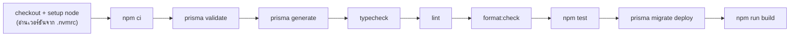

# เทสต์และ CI

โปรเจกนี้มีสามชั้นที่คอยจับความผิดพลาด — unit test, smoke test end-to-end และ CI
เอกสารนี้อธิบายว่าแต่ละไฟล์เทสต์อะไร ทำงานยังไง และ **ทำไมถึงเลือกเทสต์สิ่งนั้น**

---

## หลักที่ใช้เลือกว่าจะเทสต์อะไร

ไม่ได้ตั้งเป้าเป็นเปอร์เซ็นต์ coverage แต่เลือกครอบสองแบบ:

1. **ตรรกะล้วนที่ผิดแล้วเจ็บ** — กฎการเปลี่ยนสถานะ การตรวจชนิดไฟล์ การล้าง HTML
   ของพวกนี้ไม่ต้องใช้ฐานข้อมูลหรือเบราว์เซอร์ เขียนเทสต์ได้ตรง ๆ และรันเร็ว
2. **เส้นทางที่ถ้าพังแล้วเว็บใช้ไม่ได้เลย** — ล็อกอิน หยิบใส่ตะกร้า เปิดใบเสนอราคา
   ของพวกนี้ต้องใช้เบราว์เซอร์จริง

ส่วนที่ **ไม่ได้เทสต์** โดยตั้งใจคือ CRUD ธรรมดาที่ Prisma กับ Zod รับประกันให้อยู่แล้ว
และหน้าตาของ component — ต้นทุนการดูแลสูงกว่าประโยชน์ที่ได้

---

## ชั้นที่ 1 — Unit test (Vitest)

```bash
npm test              # รันครั้งเดียว
npm run test:watch    # รันค้างไว้ แก้ไฟล์แล้วรันซ้ำเอง
npm run test:coverage # รายงาน coverage (text + html)
```

ไม่ต้องมีฐานข้อมูล ไม่ต้อง build รันได้ทันทีหลัง `npm install`

### สิ่งที่ต้องรู้ใน `vitest.config.ts`

| บรรทัด                                | เหตุผล                                                                                                                                                                                                            |
| ------------------------------------- | ----------------------------------------------------------------------------------------------------------------------------------------------------------------------------------------------------------------- |
| `environment: "node"`                 | เทสต์ทั้งหมดเป็นตรรกะฝั่งเซิร์ฟเวอร์ ไม่ต้องจำลอง DOM                                                                                                                                                             |
| `include: ["src/**/*.test.{ts,tsx}"]` | ของเดิมจับแค่ `.ts` จึงเขียนเทสต์ component ไม่ได้เลย                                                                                                                                                             |
| `alias: { "server-only": …stub }`     | `lib/db.ts` มี `import "server-only"` กันไม่ให้ client component ลาก Prisma เข้าเบราว์เซอร์ แต่ Vitest ไม่ใช่บันเดิลเบราว์เซอร์ — ถ้าไม่ alias ไปที่ stub ว่าง เทสต์ของโมดูลที่แตะ `db` จะพังทั้งที่ไม่ได้ผิดอะไร |
| `coverage.exclude: components`        | ไม่นับ component เพราะไม่ได้ตั้งใจเทสต์ UI อยู่แล้ว การนับรวมจะทำให้ตัวเลขหลอกตา                                                                                                                                  |

ไฟล์ stub อยู่ที่ `src/test/server-only-stub.ts` — ว่างเปล่าโดยตั้งใจ

### เทสต์แต่ละไฟล์

#### `src/features/orders/order-status.test.ts` — กฎการเปลี่ยนสถานะใบจอง

ครอบ state machine ที่ [flows.md](./flows.md#แอดมินเปลี่ยนสถานะใบจอง) อธิบายไว้

| เคส                                           | พิสูจน์อะไร                                                          |
| --------------------------------------------- | -------------------------------------------------------------------- |
| เดินหน้าตามลำดับได้                           | `PENDING → CONFIRMED → COMPLETED` ผ่าน                               |
| ยกเลิกได้ตราบใดที่ยังไม่จบ                    | ทั้ง `PENDING` และ `CONFIRMED` ไป `CANCELLED` ได้                    |
| ข้ามขั้นไม่ได้                                | `PENDING → COMPLETED` ต้องถูกปฏิเสธ                                  |
| ย้อนกลับไม่ได้                                | `CONFIRMED → PENDING` ต้องถูกปฏิเสธ                                  |
| สถานะปลายทางออกไปไหนไม่ได้                    | `COMPLETED` / `CANCELLED` ไปต่อไม่ได้ — บั๊กเดิมที่ทำให้รายงานเพี้ยน |
| เขียนค่าเดิมทับ                               | ถือว่าไม่มีอะไรเปลี่ยน ไม่ใช่ error                                  |
| **`nextStatuses` ตรงกับกฎ**                   | กันไม่ให้ปุ่มใน UI หลุดจากกฎฝั่งเซิร์ฟเวอร์                          |
| `assertTransition` โยน error ที่อ่านรู้เรื่อง | ข้อความต้องบอกเหตุผล ไม่ใช่แค่ "invalid"                             |

เคสที่ 7 เป็นตัวที่มีค่าที่สุด — มันผูกให้ UI กับ API ใช้กฎชุดเดียวกันตลอดไป
ถ้ามีคนเพิ่มสถานะใหม่แล้วลืมอัปเดตฝั่งใดฝั่งหนึ่ง เทสต์นี้จะแดง

#### `src/lib/storage/sniff.test.ts` — ตรวจชนิดไฟล์จาก magic bytes

ครอบช่องโหว่ที่เล่าไว้ใน [interview-notes.md](./interview-notes.md)

| เคส                                               | พิสูจน์อะไร                                                            |
| ------------------------------------------------- | ---------------------------------------------------------------------- |
| อ่าน PNG / JPEG / PDF จาก magic bytes             | กรณีปกติทำงานถูก                                                       |
| WebP ต้องเช็คทั้ง `RIFF` และ `WEBP`               | เช็คแค่ 4 ไบต์แรกไม่พอ                                                 |
| ไม่หลงกับ `RIFF` ที่ไม่ใช่ WebP (เช่นไฟล์ WAV)    | ต่อจากข้อบน — ไฟล์ WAV ก็ขึ้นต้นด้วย `RIFF`                            |
| **ไม่เชื่อ Content-Type เมื่อเนื้อไฟล์เป็น HTML** | หัวใจของช่องโหว่ — ส่ง HTML ที่อ้างว่าเป็น `image/png` ต้องไม่ผ่าน     |
| **ไม่เชื่อ SVG ที่อ้างว่าเป็นรูป**                | SVG รันสคริปต์ได้ จึงไม่อยู่ใน allowlist                               |
| ไฟล์ที่ไม่รู้จักต้องคืน `null`                    | ห้ามปล่อยผ่านเป็น `.bin` — ผู้เรียกต้องได้โอกาสปฏิเสธ                  |
| ไฟล์ว่าง                                          | ไม่ตรงลายเซ็นไหน                                                       |
| ZIP เลือกนามสกุลตาม MIME ที่ประกาศ                | docx/xlsx แยกจาก magic bytes ไม่ได้ จึงยอมให้เลือก **แต่เฉพาะในลิสต์** |
| จัดหมวด `image` / `document` ถูก                  | เพื่อให้ endpoint รูปปฏิเสธเอกสาร และกลับกัน                           |

#### `src/lib/sanitize.test.ts` — ล้าง HTML จาก rich text editor

คำอธิบายสินค้าเก็บเป็น HTML ที่แอดมินพิมพ์ผ่าน Tiptap ถ้าไม่ล้างก่อนแสดง
คือ stored XSS

| เคส                                       | พิสูจน์อะไร                              |
| ----------------------------------------- | ---------------------------------------- |
| เก็บการจัดรูปแบบปกติไว้                   | ล้างแล้วต้องไม่ทำลายของที่ควรใช้ได้      |
| ตัด `<script>` ทั้งแท็กและเนื้อข้างใน     | ไม่ใช่แค่ตัดแท็กแล้วเหลือโค้ดเป็นข้อความ |
| ตัด attribute ที่เป็น event handler       | `onclick` / `onerror`                    |
| ตัดแท็กนอก allowlist เช่น `` | ใช้ allowlist ไม่ใช่ blocklist           |
| ตัดลิงก์ `javascript:` แต่เก็บ href ปกติ  |                                          |
| เติม `rel` ให้ลิงก์ที่เปิดแท็บใหม่        | กัน tabnabbing                           |
| ปล่อยผ่าน `style` เฉพาะ `text-align`      | Tiptap ใช้อันนี้จริง อันอื่นไม่ต้อง      |
| ตัด iframe และ comment ที่ซ่อน payload    |                                          |
| รับค่าว่างและ `null` ได้                  | ไม่พังเมื่อสินค้ายังไม่มีคำอธิบาย        |

#### `src/features/orders/group-items.test.ts` — รวมสินค้าหลักกับสินค้าคู่

ฟังก์ชันชุดนี้ถูกใช้ 5 ที่ที่ต้องได้ตัวเลขตรงกัน — หน้า checkout, หน้ารายละเอียดใบจอง
ของลูกค้า, อีเมลยืนยัน (`/api/orders`), หน้ารายการและรายละเอียดฝั่งแอดมิน
ถ้าคำนวณไม่ตรงกัน ลูกค้ากับแอดมินจะเห็นจำนวนคนละเลขบนใบเดียวกัน

ครอบ `groupItemsByProduct` · `hasGroupableItems` · `calculateGroupedSummary` ·
`groupOrderItems` · `toEmailItems` โดยเคสที่สำคัญคือ

- **แยกจำนวนสินค้าหลักกับสินค้าคู่ออกจากกัน** — กล้อง 2 ตัวที่มีขาตั้ง ต้องไม่นับเป็น 4
- **สินค้าที่ถูกลบไปแล้วไม่ถูกยุบรวมกันเป็นก้อนเดียว** — `productId` เป็น `null` ได้
  (เพราะ FK เป็น `SetNull`) ถ้ายุบตาม id ทุกสินค้าที่ถูกลบจะกลายเป็นรายการเดียวกัน

#### `src/lib/api/query.test.ts` — ตัวอ่าน query string

ทุก endpoint ที่แบ่งหน้าและกรองข้อมูลผ่านสองฟังก์ชันนี้ ค่าที่มาจาก URL
เชื่อไม่ได้เลยเพราะใครก็พิมพ์อะไรก็ได้

| เคส                                        | พิสูจน์อะไร                                            |
| ------------------------------------------ | ------------------------------------------------------ |
| `parseEnumParam` ทิ้งค่าที่ไม่มีใน enum    | ไม่ส่งค่ามั่วต่อไปให้ Prisma แล้วให้มันพังเอง          |
| `"all"` คือไม่กรอง                         | ข้อตกลงร่วมของทุกหน้ารายการ                            |
| `parsePagination` กันหน้าติดลบและหน้าศูนย์ | `skip` ติดลบทำให้ query พัง                            |
| **จำกัดจำนวนต่อหน้า**                      | ไม่ให้ยิง `?limit=999999` แล้วดึงทั้งตารางในครั้งเดียว |
| ไม่พังเมื่อค่าที่ส่งมาไม่ใช่ตัวเลข         | `?page=abc`                                            |

#### `src/features/products/services/search-products.test.ts` — ประตูของ full-text

เทสต์เฉพาะ `shouldUseFullText` ซึ่งเป็นส่วนที่เป็นตรรกะล้วน
(ตัว query จริงต้องมี Postgres จึงไปพิสูจน์ในสภาพแวดล้อมจริงแทน)

| เคส                                              | พิสูจน์อะไร                                              |
| ------------------------------------------------ | -------------------------------------------------------- |
| คำที่ยาวพอใช้ full-text                          |                                                          |
| คำสั้นเกินไปตกไปใช้ ILIKE                        | `tsquery` กับหนึ่งตัวอักษรไม่มีความหมาย                  |
| คำที่มีแต่อักขระพิเศษของ `tsquery`               | ต้องไม่ถือว่าค้นได้ ไม่งั้นจะยิง query ว่างเข้า Postgres |
| **ผู้ใช้เขียนตัวดำเนินการของ tsquery เองไม่ได้** | `&` `                                                    | ` `!` `:*` ถูกตัดทิ้งก่อนประกอบเป็น query |

#### `src/lib/utils.test.ts` — ตัวช่วยเล็ก ๆ

`cn` (รวมคลาส Tailwind — ตัวท้ายต้องชนะเมื่อชนกัน) · `getErrorMessage`
(ดึงข้อความจากสิ่งที่ `throw` มาได้ทุกแบบ) · `formatCurrency` (สกุลเงินบาท)

---

## ชั้นที่ 2 — Smoke test (Playwright)

```bash
npm run e2e:setup              # ครั้งแรกครั้งเดียว — โหลด Chromium
npm run build && npm run test:e2e
```

**ข้อบังคับสามข้อ** ที่ถ้าไม่ทำจะพังแบบงง ๆ:

1. **ต้อง `npm run e2e:setup` ก่อน** — เบราว์เซอร์ไม่ได้มากับ `npm install`
2. **ต้อง build ก่อน** — `webServer` ใน config สั่ง `npm run start` ซึ่งต้องมีผลลัพธ์จาก build
3. **ฐานข้อมูลต้องถูก seed แล้ว** — สเปกใช้บัญชีและ slug จาก `prisma/seed.ts` ตรง ๆ

### สิ่งที่ต้องรู้ใน `playwright.config.ts`

| ค่า                           | เหตุผล                                                    |
| ----------------------------- | --------------------------------------------------------- |
| `fullyParallel: false`        | ทุกสเปกใช้ฐานข้อมูลตัวเดียวกัน รันขนานกันจะกวนกันเอง      |
| `workers: 1`                  | เหตุผลเดียวกัน                                            |
| `retries: 1` เฉพาะบน CI       | กันเทสต์แดงเพราะจังหวะ ไม่ใช่เพราะโค้ดผิด                 |
| `locale: "th-TH"`             | ทุก selector ค้นด้วยข้อความไทย                            |
| `reuseExistingServer` ตอน dev | มีเซิร์ฟเวอร์รันอยู่แล้วก็ใช้ตัวเดิม ไม่ต้องรอ start ใหม่ |
| `trace: "on-first-retry"`     | เก็บ trace เฉพาะตอนพังจริง ไม่ถ่วงรอบปกติ                 |

### `e2e/helpers.ts`

เก็บบัญชีและ slug จาก seed ไว้ที่เดียว (`DEMO` / `ADMIN` / `STAFF` /
`SEED_PRODUCT_SLUG`) **ถ้าแก้ข้อมูลตัวอย่างใน `prisma/seed.ts` ต้องมาแก้ที่นี่ด้วย**

`fillCredentials()` มีอยู่เพราะกับดักหนึ่งข้อ:

> `getByLabel(/รหัสผ่าน/i)` เจอสองตัว เพราะปุ่มสลับการมองเห็นรหัสผ่านมี
> `aria-label="แสดงรหัสผ่าน"` ซึ่งมีคำว่า "รหัสผ่าน" อยู่ข้างใน Playwright
> เจอสองตัวแล้วปฏิเสธทันที — ต้องใส่ `exact: true`

### สเปกแต่ละไฟล์

#### `e2e/auth.spec.ts` — การเข้าสู่ระบบ

| เทสต์                                                 | พิสูจน์อะไร                                   |
| ----------------------------------------------------- | --------------------------------------------- |
| คนที่ยังไม่ล็อกอินถูกพาไปหน้า login                   | middleware ทำงาน                              |
| ลูกค้าล็อกอินแล้วเข้าหน้าแรกได้                       | เส้นทางปกติ                                   |
| **รหัสผ่านผิดไม่บอกว่าอีเมลนั้นเป็นบัญชีผู้ดูแลระบบ** | เทสต์ป้องกันการถอยหลังของช่องโหว่ที่เคยมีจริง |

เทสต์ตัวที่สามน่าสนใจตรงที่มันยืนยัน **สิ่งที่ต้องไม่มี** ไม่ใช่สิ่งที่ต้องมี —
ยอมรับได้ทั้งข้อความ "อีเมลหรือรหัสผ่านไม่ถูกต้อง" และ "ถูกล็อคชั่วคราว"
(ขึ้นกับว่ารันซ้ำมากี่รอบจนติด rate limit) แต่ต้องไม่มีข้อความที่เผยว่าเป็นบัญชีแอดมิน

#### `e2e/booking.spec.ts` — เส้นทางการจอง

| เทสต์                                   | พิสูจน์อะไร              |
| --------------------------------------- | ------------------------ |
| เปิดหน้าสินค้าแล้วหยิบใส่ตะกร้าได้      | เส้นทางหลักของฝั่งลูกค้า |
| ดูประวัติการจองของตัวเองได้             |                          |
| เข้าหน้าใบเสนอราคาของคำสั่งจองตัวเองได้ | เจ้าของเห็นข้อมูลจริง    |

สองจุดที่จงใจ **ไม่** คลิกผ่าน UI:

- เข้าหน้าสินค้าตรงด้วย slug จาก seed แทนการกดลิงก์ในหน้าแรก เพราะชื่อหมวดหมู่
  ในแถบข้างกับชื่อสินค้าซ้ำคำกัน ทำให้เลือกลิงก์ไม่ชัดเจน
- อ่าน id ของใบจองจาก `href` แล้วเข้าตรง แทนการคลิกการ์ดในหน้ารายการ เพราะกระดิ่ง
  บน navbar ก็มีลิงก์ `/orders/<id>` เหมือนกัน และหน้ารายการไม่ได้ห่อเนื้อหาด้วย `<main>`

> นี่เป็นการตัดสินใจที่ตั้งใจ ไม่ใช่การเลี่ยงปัญหา — สิ่งที่ smoke test ต้องพิสูจน์คือ
> **หน้าเปิดได้และข้อมูลถูก** ไม่ใช่ว่าการ์ดกดได้ การผูกกับลำดับ DOM ทำให้เทสต์เปราะ
> จนแดงบ่อยกว่าจะจับบั๊กได้จริง

#### `e2e/audit.spec.ts` — ประวัติการใช้งานระบบ

| เทสต์                                        | พิสูจน์อะไร                                 |
| -------------------------------------------- | ------------------------------------------- |
| แอดมินเปลี่ยนการตั้งค่าแล้วมีบันทึกในประวัติ | audit log ถูกเขียนจริงเมื่อมีการเปลี่ยนแปลง |
| ค้นประวัติด้วยชื่อที่คนอ่านออกได้            | `entityLabel` ใช้งานได้จริง                 |

รายละเอียดการเขียนที่มีเหตุผลชัด:

- **สลับสถานะเปิด/ปิดเว็บสองครั้ง** เพื่อให้ค่ากลับมาเหมือนเดิมแต่มีบันทึกเกิดขึ้น
  — เทสต์ไม่ทิ้งสภาพแวดล้อมไว้ผิดจากเดิม
- **ยิง API ด้วย `page.evaluate` ไม่ใช่ `page.request`** เพราะคุกกี้ session ของ
  NextAuth ต้องถูกส่งไปด้วย ซึ่ง `fetch` ในบริบทของหน้าทำให้เองอยู่แล้ว
- **ตรวจว่าบันทึกแสดงเป็นภาษาไทย** ไม่ใช่ชื่อฟิลด์ดิบแบบ `showHomePage: false`
- ใช้ `toHaveURL(/\/admin$/)` ไม่ใช่ `/\/admin/` เพราะแบบหลัง **ผ่านตั้งแต่ยังอยู่ที่
  `/admin/login`** เทสต์จะดูเหมือนผ่านแล้วไปตายตอนเรียก API

#### `e2e/dev-tools.spec.ts` — เครื่องมือระบบและการกั้นสิทธิ์

| เทสต์                                                  | พิสูจน์อะไร                    |
| ------------------------------------------------------ | ------------------------------ |
| superadmin เข้าเครื่องมือระบบได้และเห็นสถานะข้อมูล     | ฟีเจอร์ทำงาน                   |
| สั่งรันงานตามเวลาแล้วมีบันทึกในประวัติ                 | การกระทำที่มีผลถูกบันทึกเสมอ   |
| **แอดมินธรรมดาไม่เห็นเมนู และเรียก API ตรง ๆ ไม่ได้**  | การซ่อนเมนูไม่ใช่การกั้นสิทธิ์ |
| **แอดมินธรรมดาเลื่อนขั้นตัวเองเป็น superadmin ไม่ได้** | กันการยกระดับสิทธิ์            |

สองเทสต์ล่างคือเหตุผลที่ไฟล์นี้มีอยู่ — ตรวจว่า `requireSuperAdmin()` กันจริงที่ API
ไม่ใช่แค่ที่หน้าจอ ถ้าใครเผลอเปลี่ยน guard เป็น `requireAdmin()` เทสต์นี้จะจับได้

---

## ชั้นที่ 3 — CI (`.github/workflows/ci.yml`)

รันเมื่อ push เข้า `main` และเมื่อเปิด PR เข้า `main` มีสอง job

### job `verify` — ด่านหลัก



**ทำไมต้องมี PostgreSQL เป็น service** — การ build ต้องมีฐานข้อมูลจริง
เพราะบางหน้าอ่านค่าตั้งค่าจาก DB ตอน prerender ถ้าไม่มี DB จะพังตอน build
ไม่ใช่ตอนรัน (ใช้ image `postgres:17-alpine` พร้อม health check)

**ทำไม `migrate deploy` อยู่ก่อน build ไม่ใช่ก่อน test** — เทสต์ Vitest
ไม่แตะฐานข้อมูลเลย จึงไม่ต้องรอ migrate ให้เสียเวลา

**ทำไมไม่มีด่านตรวจ schema drift** — มีคอมเมนต์อธิบายไว้ในไฟล์ workflow:
`Product.searchVector` เป็น `GENERATED ALWAYS` และมี index `gin_trgm_ops`
ซึ่ง Prisma อธิบายใน schema ไม่ได้ `prisma migrate diff --exit-code` จึงรายงาน
ความต่างตลอดเวลาแม้ทุกอย่างถูกต้อง — เป็นการปิดโดยเจตนา
(สคริปต์ `npm run db:diff` ยังมีไว้เรียกเองตอนตรวจ schema อื่น ๆ)

### job `audit` — ตรวจช่องโหว่ของ dependency

```yaml
run: npm audit --audit-level=high
continue-on-error: true
```

แยกเป็น job ของตัวเองและตั้ง `continue-on-error` เพราะเป็นเรื่องของ dependency
ไม่ใช่ของโค้ดใน PR นั้น **ช่องโหว่ที่โผล่มาใหม่ไม่ควรทำให้ PR ที่ไม่เกี่ยวข้องกลายเป็นสีแดง**
— แต่ยังอยากเห็นว่ามีอะไรใหม่ จึงไม่ตัดทิ้ง

### e2e ไม่ได้อยู่ใน CI

Playwright ต้องมีฐานข้อมูลที่ seed แล้ว + build เสร็จ + เซิร์ฟเวอร์รันอยู่
ซึ่งทำให้รอบ CI นานขึ้นมากสำหรับโปรเจกขนาดนี้ ตอนนี้จึงรันเองในเครื่องก่อนเปิด PR
ถ้าจะเพิ่มเข้า CI ให้ต่อจาก job `verify` แล้วเรียก `npm run db:seed` ก่อน `test:e2e`

---

## ตารางสรุป

| ไฟล์                       | ชนิด | ครอบอะไร                                 | ต้องมีอะไรก่อนรัน |
| -------------------------- | ---- | ---------------------------------------- | ----------------- |
| `order-status.test.ts`     | unit | กฎการเปลี่ยนสถานะใบจอง                   | —                 |
| `sniff.test.ts`            | unit | ตรวจชนิดไฟล์จาก magic bytes              | —                 |
| `sanitize.test.ts`         | unit | ล้าง HTML กัน stored XSS                 | —                 |
| `group-items.test.ts`      | unit | รวมสินค้าหลัก + สินค้าคู่                | —                 |
| `query.test.ts`            | unit | อ่าน query string อย่างปลอดภัย           | —                 |
| `search-products.test.ts`  | unit | ประตูของ full-text                       | —                 |
| `utils.test.ts`            | unit | ตัวช่วยเล็ก ๆ                            | —                 |
| `e2e/auth.spec.ts`         | e2e  | ล็อกอิน + ไม่เผยบัญชีแอดมิน              | build + seed      |
| `e2e/booking.spec.ts`      | e2e  | สินค้า → ตะกร้า → ใบจอง → ใบเสนอราคา     | build + seed      |
| `e2e/audit.spec.ts`        | e2e  | ประวัติการใช้งานถูกบันทึกและค้นได้       | build + seed      |
| `e2e/dev-tools.spec.ts`    | e2e  | เครื่องมือระบบ + การกั้นสิทธิ์           | build + seed      |
| `.github/workflows/ci.yml` | CI   | typecheck → lint → format → test → build | —                 |

---

## คำสั่งเต็มก่อนเปิด PR

```bash
npm run typecheck && npm run lint && npm run format:check && npm test && npm run build
npm run test:e2e
```

> **อ่านผลให้ครบ อย่า `tail -3`** — เคยรายงานว่าเทสต์ผ่านทั้งที่พังอยู่
> เพราะบรรทัดสรุปถูกตัดทิ้ง ให้ `grep -E "Test Files|Tests "` แทน
>
> `npm run build` พิมพ์ตารางเส้นทางท้ายสุด การเอา `| grep` ต่อท้ายทำให้ exit code
> มาจาก grep ไม่ใช่ build — ถ้าจะเช็คว่าผ่านไหมให้ดู `Failed to type check`
> หรือ `Build error` ตรง ๆ
